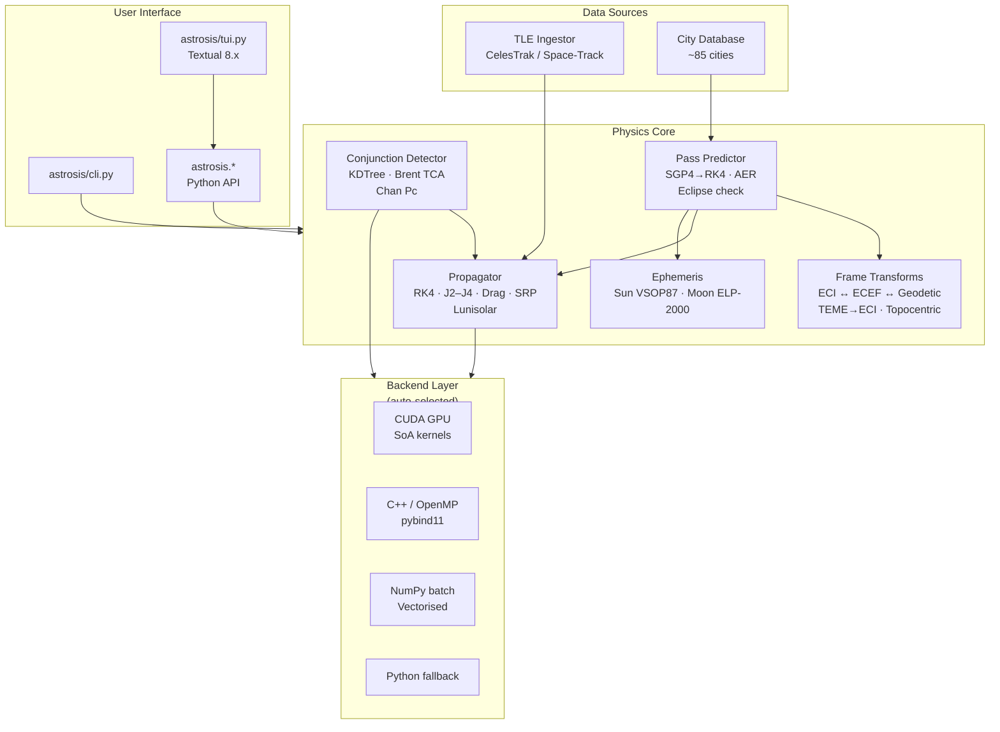

# Astrosis — portable HPC numerics for orbital mechanics

A single orbital-mechanics workload implemented four times — CUDA, C++/OpenMP,
NumPy, and pure Python — behind one auto-selecting API, so you can *measure*
where each backend wins and why. The orbital-mechanics UI is the excuse; the
portability study is the point.

[](https://github.com/UtkarshJoshiNtl/Astrosis/actions)
[](LICENSE)
[](https://pypi.org/project/astrosis/)
[](https://pypi.org/project/astrosis/)


<details>
<summary><b>Table of Contents</b></summary>

- [What this project studies](#what-this-project-studies)
- [The headline finding](#the-headline-finding)
- [Quick start](#quick-start)
- [Python API](#python-api)
- [Features](#features)
- [Performance](#performance)
- [Architecture](#architecture)
- [Backend auto-selection](#backend-auto-selection)
- [TUI reference](#tui-reference)
- [CLI reference](#cli-reference)
- [Contributing](#contributing)
- [License](#license)

</details>

## What this project studies

Every backend computes the *same* RK4 + J2–J4 propagation, and the router in
`astrosis/core/accelerator.py` picks one at runtime. That setup turns three
questions you cannot answer from theory alone into measured data:

1. **When is the GPU the right tool?** At what problem size does CUDA launch
   overhead + PCIe transfer stop paying for themselves?
2. **When is a multicore CPU the right tool?** C++/OpenMP has no transfer cost
   and sub-millisecond latency — is it ever *faster* than a GPU?
3. **How portable is "portable"?** One benchmark matrix, four implementations,
   no vendor lock-in. Same numerics everywhere (FP64, IEEE 754, no
   `-ffast-math`), so the comparison is honest.

The answers are in the benchmark numbers below — and one of them is
counter-intuitive enough to matter for real systems design.

## The headline finding

**The CPU beats the GPU at batch propagation, and the GPU wins at conjunction
screening.** Same physics, same FP64 kernels, same machine.

| Operation | Python | C++/OpenMP | CUDA |
|-----------|-------:|-----------:|-----:|
| Batch 1k sats × 864 steps | 7074 ms | **13 ms (566×)** | 245 ms (29×) |
| Batch 5k sats × 864 steps | 36854 ms | **55 ms (676×)** | 291 ms (127×) |
| Conjunction 200×200 1 h | 6262 ms | 498 ms (13×) | **45 ms (139×)** |
| Conjunction 400×400 2 h | 26677 ms | 3856 ms (7×) | **125 ms (214×)** |

Why: propagation is launch-bound at these sizes — CUDA pays a fixed per-call
cost plus a host↔device round trip, while OpenMP's cost is a few wakeups. When
CUDA overlaps transfer and compute (streamed mode), the gap narrows (1k sats:
99 ms streamed vs 245 ms SoA) but does not close. Conjunction screening, by
contrast, is a compute-bound pairwise scan with no per-satellite launch — that
is where 16 SMs beat 6 cores, by up to 214×.

The shape of this trade-off — "offload only if the kernel is big enough to
amortise the transfer" — is the transferable lesson. Detailed scaling,
SoA-vs-AoS memory layout (1.4× throughput, ~6.8× bandwidth utilisation),
roofline (kernel is compute-bound at 2.5 FLOP/byte vs a 1.04 ridge point), and
kernel occupancy (100% propagation, 92% conjunction) live in
[docs/performance.md](docs/performance.md).

## Quick start

```bash
pip install astrosis

# TUI (no args)
astrosis

# CLI
astrosis passes --city Mumbai --id 25544
astrosis info --id 25544
```

No GPU required — CUDA is optional. Falls back to C++/OpenMP → NumPy → Python
automatically on any machine. Python ≥ 3.10.

## Python API

```python
import astrosis

# Propagate a single satellite forward
state = astrosis.propagate(
    [6678, 0, 0, 0, 7.7, 0],  # ECI: x, y, z, vx, vy, vz (km, km/s)
    dt_seconds=86400
)

# Batch propagate — auto-picks fastest backend
states = astrosis.propagate_batch(
    initial_states, dt_seconds=60, steps=1440
)

# Conjunction screening
warnings = astrosis.detect_conjunctions(
    satellites, debris, lookahead=86400, step_s=60
)

# Check which backend is active
print(astrosis.backend_info())
```

Full reference: [docs/api.md](docs/api.md).

## Features

| Category | Capabilities |
|----------|-------------|
| **Propagation** | RK4 with J2/J3/J4, atmospheric drag (US Standard 1976), SRP, lunisolar third-body |
| **Auto-backend** | CUDA GPU → C++ OpenMP → NumPy batch → Python fallback |
| **Conjunction** | KDTree broad-phase, pairwise distance scan, Brent TCA refinement, Chan collision probability |
| **Pass prediction** | SGP4 → RK4 handoff, elevation/visibility filtering, ~85 cities built-in |
| **Ephemeris** | Sun/Moon ECI positions via VSOP87/ELP-2000, eclipse state (umbra/penumbra) |
| **TUI** | 6 modes, help overlay, JSON export, persistence, autocomplete cities |
| **Coordinate frames** | ECI ⇄ ECEF, TEME → ECI, geodetic, topocentric (az/el/range), GMST + equation of equinoxes |

Position accuracy: integrator error < 0.1 km at 24 h. Real-world accuracy is
dominated by TLE uncertainty (0.1–1 km), not the propagator. All backends are
validated against SGP4 and energy-conservation checks in
[docs/validation.md](docs/validation.md) — identical physics, not just
identical output.

## Performance

Benchmarked on RTX 2050 + Ryzen 5. Full suite, scaling analysis, roofline, and
occupancy: [docs/performance.md](docs/performance.md).

| Operation | Python | C++ | CUDA |
|-----------|-------:|----:|-----:|
| Single sat (50k steps) | 391 ms | **21 ms (19×)** | N/A |
| Batch 1k sats × 864 steps | 7074 ms | **13 ms (566×)** | 245 ms (29×) |
| Batch 5k sats × 864 steps | 36854 ms | **55 ms (676×)** | 291 ms (127×) |
| Conjunction 200×200 1h | 6262 ms | 498 ms (13×) | **45 ms (139×)** |
| Conjunction 400×400 2h | 26677 ms | 3856 ms (7×) | **125 ms (214×)** |

C++/OpenMP is faster than CUDA for batch propagation at all tested sizes (no
PCIe overhead, no per-call launch). CUDA dominates conjunction screening where
pairwise calculations are compute-bound.


See [docs/performance.md](docs/performance.md) for full benchmarks, scaling
analysis, roofline, and kernel occupancy. See
[docs/validation.md](docs/validation.md) for physics validation results
(energy conservation, SGP4 comparison, J2 regression, etc.).

## Architecture



The router in `astrosis/core/accelerator.py` selects the best backend. See
[docs/architecture.md](docs/architecture.md) for data flow details and
[docs/design.md](docs/design.md) for design decisions (fixed-step RK4 vs
adaptive, J2–J4 vs EGM2008, AoS vs SoA, FP64 vs FP32).

## Backend auto-selection

Astrosis automatically picks the fastest backend for each operation:
CUDA GPU → C++/OpenMP → NumPy batch → pure Python.

```bash
$ astrosis backend
╭─────────────────────────────── Backend Status ───────────────────────────────╮
│ Active backend: CUDA                                                         │
│       ✓ CUDA  ✓ C++/OpenMP  ✓ NumPy batch  ✓ Python fallback                │
│ GPU: NVIDIA GPU                                                              │
╰──────────────────────────────────────────────────────────────────────────────╯
```

`ASTROSIS_MOCK_GPU=1` forces CPU only.

## TUI reference

Six modes (switch with `Alt+1`–`Alt+6`):

| Mode | What it does |
|------|--------------|
| **passes** | Predict satellite passes for a city or lat/lon |
| **propagate** | Propagate a NORAD ID or state vector forward |
| **conjunction** | Load CSVs and screen pairs for close approaches |
| **info** | Orbital elements, current ECI state, ground track |
| **ephemeris** | Sun/Moon ECI positions and distances |
| **backend** | Active compute backend and GPU info |

Keybindings:

| Key | Action |
|-----|--------|
| `Alt+1`–`Alt+6` | Switch mode |
| `Enter` | Run current mode |
| `Escape` | Cancel running operation |
| `Ctrl+E` | Export results to JSON |
| `F5` | Refresh / clear results |
| `F1` / `?` | Show help overlay |
| `↑↓` | Select result row (detail strip) |
| `Ctrl+Q` | Quit |

Drag/SRP parameters and conjunction advanced options are hidden behind
clickable `[+]` section headers. Input values persist across sessions
via `~/.cache/astrosis/tui_state.json`.

## CLI reference

| Command | What it does |
|---------|--------------|
| `astrosis` | Launch interactive TUI |
| `astrosis passes --city <name> --id <norad>` | Predict satellite passes |
| `astrosis info --id <norad>` | Orbital elements and current state |
| `astrosis propagate <state or id> --dt 60 --steps 1440` | Propagate forward |
| `astrosis conjunction --primary a.csv --secondary b.csv` | Conjunction screening |
| `astrosis batch <file.csv> --steps 100` | Batch propagate from CSV |
| `astrosis backend` | Show active compute backend |
| `astrosis fetch --id <norad>` | Fetch and cache TLE data |
| `astrosis ephemeris --mjd 60000` | Sun/moon positions |

## Contributing

Contributions welcome. See [docs/contributing.md](docs/contributing.md) for
dev setup, tests, code style, and PR workflow.

## License

MIT
