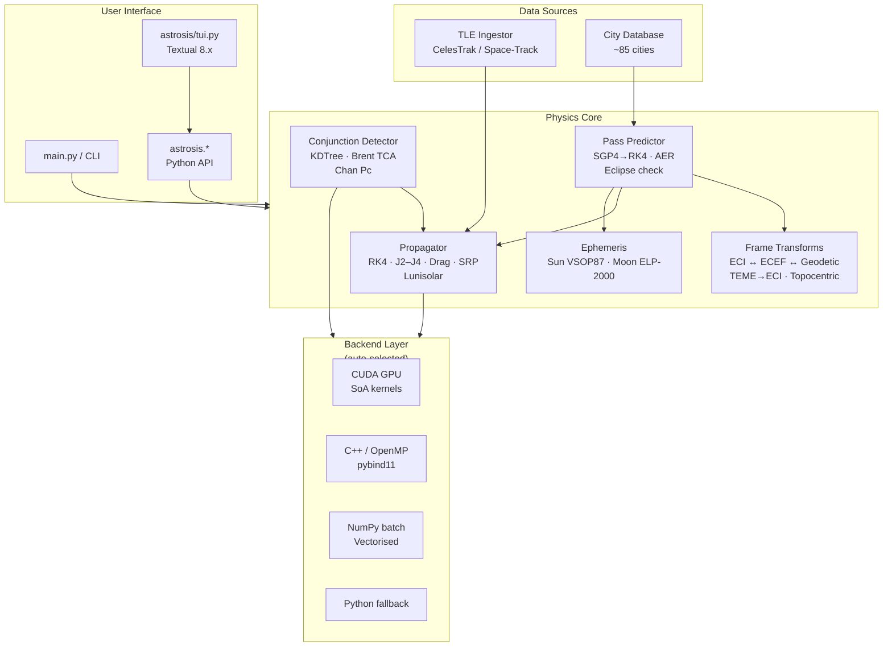

# Astrosis — orbital mechanics calculator

**Batch propagate 5,000 satellites in 75 ms.** CLI + TUI with J2/J3/J4 propagation,
conjunction screening, pass prediction, and ephemeris. Auto-selects CUDA → C++/OpenMP →
NumPy → Python backend. Zero config.

[](https://github.com/UtkarshJoshiNtl/Astrosis/actions)
[](LICENSE)
[](https://pypi.org/project/astrosis/)
[](https://pypi.org/project/astrosis/)
[](https://github.com/UtkarshJoshiNtl/Astrosis)


<details>
<summary><b>Table of Contents</b></summary>

- [Why Astrosis?](#why-astrosis)
- [Quick start](#quick-start)
- [Python API](#python-api)
- [Features](#features)
- [Architecture](#architecture)
- [Performance](#performance)
- [Backend auto-selection](#backend-auto-selection)
- [TUI reference](#tui-reference)
- [CLI reference](#cli-reference)
- [Contributing](#contributing)
- [Acknowledgments](#acknowledgments)
- [License](#license)

</details>

## Why Astrosis?

**Stop waiting for Python propagation.** Single-threaded Python does one satellite
in ~400 ms. Astrosis does 5,000 in 75 ms — a **500× speedup** — and you don't
have to think about the backend.

- **GPU auto-acceleration.** CUDA → C++/OpenMP → NumPy → Python fallback. No config
  required. The router probes your hardware and picks the fastest path.
- **Conjunction screening ready.** Built-in pairwise collision detection with Brent TCA
  refinement and Chan probability. 400 × 400 pairs in **125 ms** (CUDA).
- **TUI + CLI duality.** Rich interactive TUI (6 modes, collapsible sections, JSON export)
  plus full CLI for scripting. Same Python API under both.

If you can `pip install`, you can use Astrosis.

## Quick start

```bash
pip install astrosis

# TUI (no args)
astrosis

# CLI
astrosis passes --city Mumbai --id 25544
astrosis info --id 25544
```

## Python API

Use Astrosis as a library in your own scripts:

```python
import astrosis

# Propagate a single satellite 24 hours forward
state = astrosis.propagate(
    [6678, 0, 0, 0, 7.7, 0],  # ECI: x, y, z, vx, vy, vz (km, km/s)
    dt_seconds=86400
)
print(f"After 24 h: {state}")

# Batch propagate 1,000 satellites — auto-picks fastest backend
states = astrosis.propagate_batch(
    initial_states, dt_seconds=60, steps=1440
)

# Conjunction screening
warnings = astrosis.detect_conjunctions(
    satellites, debris, lookahead=86400, step_s=60
)

# Check which backend is active
print(astrosis.backend_info())
```

## Features

| Category | Capabilities |
|----------|-------------|
| **Propagation** | RK4 with J2/J3/J4, atmospheric drag (US Standard 1976), SRP, lunisolar third-body |
| **Auto-backend** | CUDA GPU → C++ OpenMP → NumPy batch → Python fallback, transparent fallback |
| **Conjunction** | KDTree broad-phase, pairwise distance scan, Brent TCA refinement, Chan collision probability |
| **Pass prediction** | SGP4 → RK4 seamless handoff, elevation/visibility filtering, ~85 cities built-in |
| **Ephemeris** | Sun/Moon ECI positions via VSOP87/ELP-2000, eclipse state (umbra/penumbra) |
| **TUI** | 6 modes, help overlay, collapsible advanced sections, JSON export, persistence, autocomplete cities |
| **Coordinate frames** | ECI ⇄ ECEF, TEME → ECI, geodetic, topocentric (az/el/range), GMST + equation of equinoxes |

## Architecture



The router in `astrosis/core/accelerator.py` probes `cuda_available()`, C++ module
presence, and falls back through the layers — all transparent to the caller.

## Performance

| Operation | Python | C++ | CUDA |
|-----------|-------:|----:|-----:|
| Single sat (50k steps) | 391 ms | **21 ms (19×)** | N/A |
| Batch 1k sats × 864 steps | 7074 ms | **13 ms (566×)** | **245 ms (29×)** |
| Batch 5k sats × 864 steps | 36854 ms | **55 ms (676×)** | **291 ms (127×)** |
| Conjunction 200×200 1h | 6262 ms | 498 ms (13×) | **45 ms (139×)** |
| Conjunction 400×400 2h | 26677 ms | 3856 ms (7×) | **125 ms (214×)** |

C++ dominates < 500 satellites (no PCIe overhead). CUDA dominates > 500 with
up to **66,483 sats/s** throughput. See [docs/performance.md](docs/performance.md)
for full crossover analysis, streamed mode benchmarks, and roofline.

## Backend auto-selection

Astrosis automatically picks the fastest backend for each operation:
CUDA GPU → C++/OpenMP → NumPy batch → pure Python.

```bash
$ astrosis backend
╭─────────────────────────────── Backend Status ───────────────────────────────╮
│ Active backend: CUDA                                                         │
│       ✓ CUDA  ✓ C++/OpenMP  ✓ NumPy batch  ✓ Python fallback                │
│ GPU: NVIDIA GPU                                                              │
╰──────────────────────────────────────────────────────────────────────────────╯
```

## TUI reference

Six modes (switch with `Alt+1`–`Alt+6`):

| Mode | What it does |
|------|--------------|
| **passes** | Predict satellite passes for a city or lat/lon |
| **propagate** | Propagate a NORAD ID or state vector forward |
| **conjunction** | Load CSVs and screen pairs for close approaches |
| **info** | Orbital elements, current ECI state, ground track |
| **ephemeris** | Sun/Moon ECI positions and distances |
| **backend** | Active compute backend and GPU info |

Keybindings:

| Key | Action |
|-----|--------|
| `Alt+1`–`Alt+6` | Switch mode |
| `Enter` | Run current mode |
| `Escape` | Cancel running operation |
| `Ctrl+E` | Export results to JSON |
| `F5` | Refresh / clear results |
| `F1` / `?` | Show help overlay |
| `↑↓` | Select result row (detail strip) |
| `Ctrl+Q` | Quit |

Drag/SRP parameters and conjunction advanced options are hidden behind
clickable `[+]` section headers. Input values persist across sessions
via `~/.cache/astrosis/tui_state.json`.

## CLI reference

| Command | What it does |
|---------|--------------|
| `astrosis` | Launch interactive TUI |
| `astrosis passes --city <name> --id <norad>` | Predict satellite passes |
| `astrosis info --id <norad>` | Orbital elements and current state |
| `astrosis propagate <state or id> --dt 60 --steps 1440` | Propagate forward |
| `astrosis conjunction --primary a.csv --secondary b.csv` | Conjunction screening |
| `astrosis batch <file.csv> --steps 100` | Batch propagate from CSV |
| `astrosis backend` | Show active compute backend |
| `astrosis fetch --id <norad>` | Fetch and cache TLE data |
| `astrosis ephemeris --mjd 60000` | Sun/moon positions |

## Contributing

Contributions welcome — whether it's a bug report, feature request, or pull
request. See [docs/contributing.md](docs/contributing.md) for:

- Dev setup and build instructions
- Running tests and physics validation
- Code style (Black, Flake8, clang-format)
- PR workflow

## Acknowledgments

Astrosis builds on excellent open-source work:

- **SGP4** — Two-line element propagation ([python-sgp4](https://github.com/brandon-rhodes/python-sgp4))
- **VSOP87 / ELP-2000** — Solar and lunar ephemerides
- **Textual** — TUI framework
- **pybind11** — C++/Python bridge
- **NumPy / SciPy** — Numerical foundation
- **CelesTrak / Space-Track** — TLE data sources

## License

MIT
