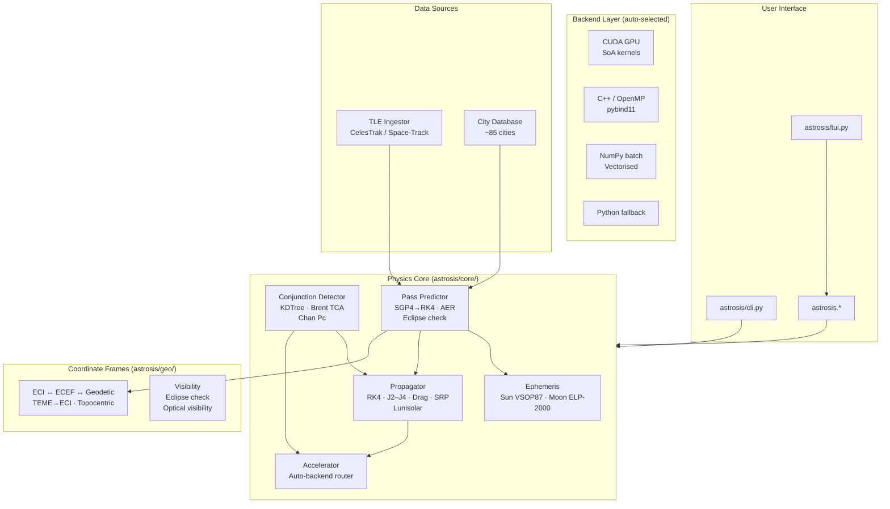

# Architecture



The router in `astrosis/core/accelerator.py` probes `cuda_available()`, C++ module
presence, and falls back through the layers.

## Backend Selection

Auto-chooses the best backend based on hardware:

```
CUDA available?
  ├─ CUDA (conjunction pairs)     → CUDA (125 ms for 400×400 pairs)
  ├─ CUDA (batch prop < 5000)     → C++/OpenMP (lower latency)
  └─ No CUDA ─┬─ C++ compiled? ─┬─ Yes → C++/OpenMP
               │                 └─ No  ──┬─ NumPy? → NumPy batch
               │                          └─ No     → pure Python
```

| Factor | Decision |
|--------|----------|
| Conjunction screening | Always prefer CUDA (31× over C++) |
| Batch propagation < 5000 | C++/OpenMP (no PCIe overhead) |
| Batch propagation 5000+ | C++/OpenMP typically faster; CUDA competitive with streamed mode |

Manual override: `ASTROSIS_MOCK_GPU=1` forces CPU.

## Data Flow: Batch Propagation

```
propagate_batch(states, dt_seconds=10, steps=8640)   # 1000 sats, 24h

  accelerator.py
    → Detects 1000 sats → C++ selected (OpenMP)
    → Python ↔ C++ FFI (pybind11)
    → One satellite per thread, aligned to 64-byte cache lines
    → C++ returns (n, 6) array in ~13 ms
```

## Data Flow: Conjunction Screening

```
detect_conjunctions(sats, debs, lookahead=36000, step_s=60)   # 500×500 pairs

  CUDA Path (2-phase):

  Phase 1 — Pre-propagation (k_prepropagate)
    Propagate 500 sats + 500 debs for 600 steps each
    Store trajectory as SoA per timestep
    Cost: O((ns+nd) × nsteps) = 600K propagations

  Phase 2 — Pair Scan (k_scan_pairs)
    Grid: (500/16, 500/16) blocks × (16,16) threads
    Coalesced reads of pre-propagated SoA arrays
    Cost: O(ns × nd × nsteps) = 150M distance calcs (no RK4)

  Speedup vs naive: ~250× (every distance calc avoids 1 propagation)
```

C++ fallback: pre-propagates all objects via `batch_propagate_full_history`,
then pairwise distance scan + Brent refinement from nearest pre-propagated frame.
